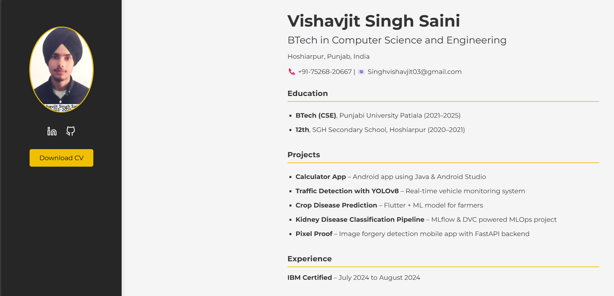
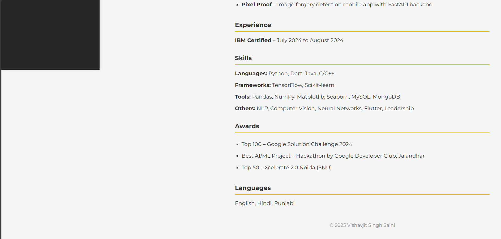

# Vishavjit Singh Saini – Developer CV Website

A responsive and modern developer CV website built using HTML, CSS, and Feather Icons. This site showcases education, skills, projects, and achievements in a professional layout.




---

## 📌 Version

**Current Version:** `v1.0.0`

### ✅ Features in this release:
- Responsive layout with sidebar navigation
- Downloadable CV button
- Integrated Feather Icons for social links
- Project list with real-world applications
- Awards, experience, and skills sections
- Fully mobile-optimized

---

## 🛠️ Tech Stack

| Technology | Purpose                     |
|------------|-----------------------------|
| HTML5      | Page structure              |
| CSS3       | Styling & responsiveness    |
| Google Fonts (Montserrat) | Clean typography |
| Feather Icons | Lightweight SVG icons     |

---

## 🚀 Getting Started

To run this project locally:

### 1. Clone the Repository

```bash
git clone https://github.com/vishavjit-singh/portfolio-cv.git
cd portfolio-cv
